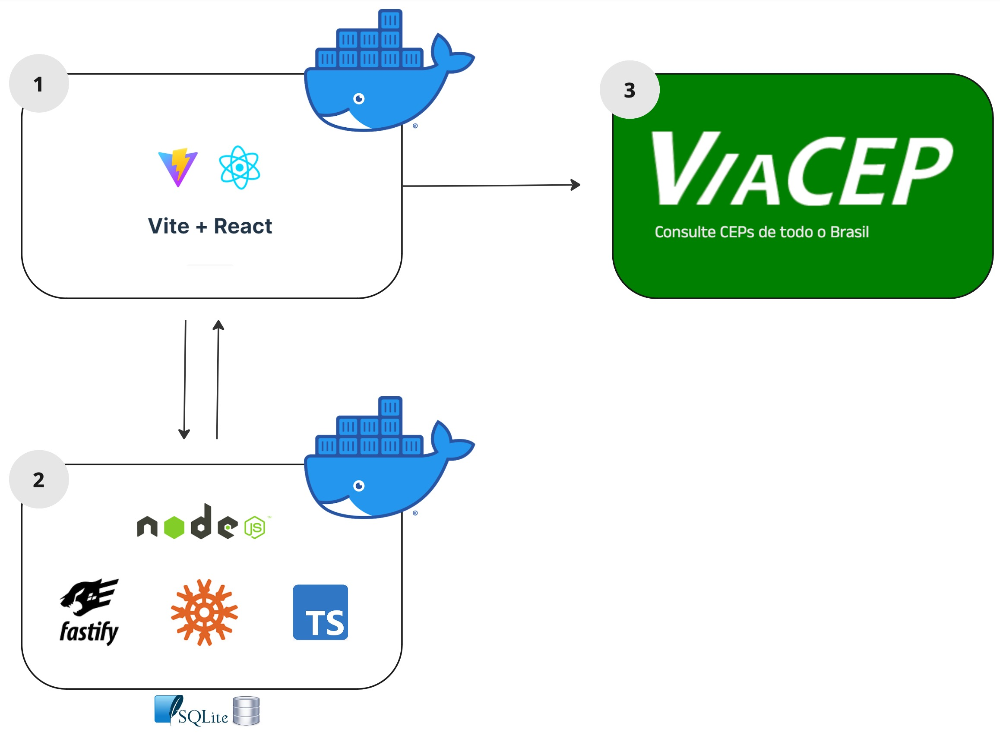

# LevaEu

> You are ate the __backend__. Source the frontend [here](https://github.com/gabrielsacampos/levaeu-react)


## Introduction

LevaEu is a dynamic platform designed to connect people with establishments, offering families an enjoyable and memorable day out. This project is in the early stages of developing a Minimum Viable Product (MVP) as part of a postgraduate Software Engineering sprint at PUC-RJ.

The backend implements the __REST API__ architeture.


### Architeture

The architecture of LevaEu comprises three main components:

1. **User Interface**: Built with [Vite + React](https://vitejs.dev)
2. **Node.js Server | REST API**: Running [Fastify](https://fastify.dev) and [Knex.js](https://knexjs.org)
3. **Third-Party API**: [ViaCep](https://viacep.com.br), an API that helps our React application find addresses by CEP code

Additionally, each component has a __Dockerfile__ to build the corresponding image.



### Steps to follow the application

To clone this repository to your local machine, follow these steps:

1. Open your terminal.
2. Change the current working directory to the location where you want the cloned directory.
3. Type the following git command and press Enter:
    ```bash
    git clone https://github.com/gabrielsacampos/levaeu-node
    ```
4. This will create a local copy of the repository in your desired directory.


#### Running the project on your local machine

1. Navigate to the project directory:
    ```bash
    cd levaeu-node
    ```

2. Ensure that the server is running by following the instructions provided in the backend documentation [here](https://github.com/gabrielsacampos/levaeu-node).

3. Build the image by running the Dockerfile and run it on port 3000:
    ```bash
    docker build -t levaeu-node .
    docker run -p 3333:3333 levaeu-node
    ```

4. Once all commands are successful, you can execute the follows HTTP methods: 


##### Establishments-controller
__GET__ ```'/establishments' ``` - returns a list of establishments.
```json
//response

   {
        "establishments": [
            {
            "id": "uuid-baoba", //string
            "name": "Baobá", //string
            "address": "Rua da  Selva, 42", //string
            "description": "O Baobá é o lugar perfeito para relaxar e desfrutar de deliciosos coquetéis e petiscos. Venha nos visitar e aproveite nossa atmosfera acolhedora e música ao vivo todas as sextas-feiras!", //string
            "id_type": "uuid-public-park", //string
            "id_sponsor": "uuid-oscar-neves", //string
            "tag": "none", //string
            "created_at": "2020-01-02 03:00:00.000000", //string
            "updated_at": "2020-02-27 03:00:00.000000" //string
            }
        ]
   }

```

##### Establishment_types-controller

__GET__ ```'/establishment_types' ``` - returns a list of establishment types registered in repository.
```json
//response
    {
        "establishmentTypes": [
            {
            "id": "uuid-cinema", //string
            "name": "cinema", //string
            "created_at": "2020-01-02 03:00:00.000000", //string
            "updated_at": "2020-01-04 03:00:00.000000" //string
            }
        ]
    }

```

##### Users-controller

__GET__ ```'/users' ``` - returns a list of users.
```json
//response

   {
    "users": [
        {
            "id": "uuid-joey-doe", //string
            "name": "Joey Doe", //string
            "image_url": "https://images.unsplash.com/photo-1507003211169-0a1dd7228f2d?q=80&w=80&auto=format&fit=crop&ixlib=rb-4.0.3&ixid=M3wxMjA3fDB8MHxwaG90by1wYWdlfHx8fGVufDB8fHx8fA%3D%3D", //string
            "email": "joey_doe@someemail.com", //string
            "global_score": 2.981, //int
            "week_score": 432, //int
            "created_at": "2020-01-02 03:00:00.000000", //string
            "updated_at": "2020-01-04 03:00:00.000000" //string
        },
    ]
   }

```

__GET__ ```'/users/{id}' ``` - returns a user data from id.
```json
//response

    {
        "id": "uuid-joey-doe", //string
        "name": "Joey Doe", //string
        "image_url": "https://images.unsplash.com/photo-1507003211169-0a1dd7228f2d?q=80&w=80&auto=format& fit=crop&ixlib=rb-4.0.3&ixid=M3wxMjA3fDB8MHxwaG90by1wYWdlfHx8fGVufDB8fHx8fA%3D%3D", //string
        "email": "joey_doe@someemail.com", //string
        "global_score": 2.981, //int
        "week_score": 432, //int
        "created_at": "2020-01-02 03:00:00.000000", //string
        "updated_at": "2020-01-04 03:00:00.000000" //string
    }

```

##### Ratings-controller
__GET__ ```'/ratings' ``` - returns a list of ratings ordered by __created_at__.
```json
//response

    {
        "ratings": [
            {
            "user_name": "Fernando Magalhães", //string
            "user_image_url": "https://images.unsplash.com/photo-1500648767791-00dcc994a43e?q=80&w=80& auto=format&fit=crop&ixlib=rb-4.0.3&ixid=M3wxMjA3fDB8MHxwaG90by1wYWdlfHx8fGVufDB8fHx8fA%3D%3D", //string
            "user_category": "scientist", //string
            "review": "Ambiente acolhedor com pizzas excepcionais. A seleção de coberturas é vasta e  saborosa. Definitivamente, um dos melhores lugares da cidade.", //string
            "date": "2024-03-22 03:00:00.000000", //string
            "stars": 5, //int
            "establishment_name": "Pizzamania", //string
            "establishment_image": "https://images.unsplash.com/photo-1694444398997-f8de6de50223?q=80&w=1469&auto=format&fit=crop&ixlib=rb-4.0.3&ixid=M3wxMjA3fDB8MHxwaG90by1wYWdlfHx8fGVufDB8fHx8fA%3D%3D", //string
            "created_at": "2024-01-02 03:00:00.000000" //string
            },
        ]
    }

```

##### Ranking-controller
__GET__ ```'/ranking' ``` -  - returns a list of users ordered by __week_score__.
```json
//response
    {
        "users": [
            {
                "user_name": "Rafael Souza", //string
                "user_image_url": "https://images.unsplash.com/photo-1522529599102-193c0d76b5b6?q=80&w=80&auto=format&fit=crop&ixlib=rb-4.0.3&ixid=M3wxMjA3fDB8MHxwaG90by1wYWdlfHx8fGVufDB8fHx8fA%3D%3D", //string
                "user_category": "curious", //string
                "global_score": 1, //int
                "week_score": 678, //int
                "created_at": "2020-01-01 03:00:00.000000" //string
            },
        ]
    }

```

